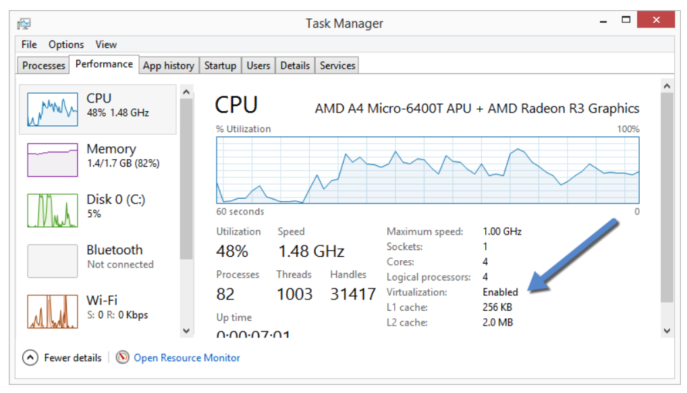
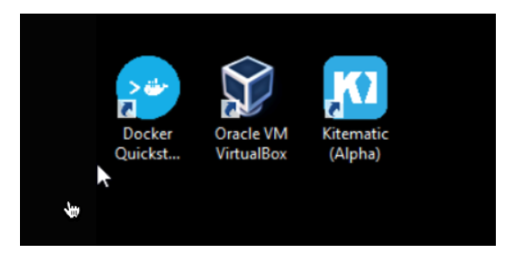

# Docker Setting for Windows

## Install Docker
* [Download & Install](https://docs.docker.com/toolbox/toolbox_install_windows/)
1. Choose Start > Task Manager and navigate to the Performance tab. Under CPU you should see the following:
    * If virtualization is not enabled on your system, follow the manufacturer’s instructions for enabling it.

2. To download the latest version of Docker Toolbox, go to [Toolbox Releases and download the latest .exe file](https://github.com/docker/toolbox/releases).
3. Click QuickStart Terminal icon

4. Check Docker
    * docker run hello-world

## Run Ubuntu 18.04 via Docker
1. ~~setting share directory @ your local machine (Not Working)~~~~
    * ~~run Docker Quickstart Terminal~~
    * ~~add any dummy file to test.~~
        * ~~ex) make test.txt file in the foler, /c/git/.~~
    * ~~run Oracle VM VirtualBox~~
        * ~~go to sharefolder menu~~
        * ~~add /c/git~~

2. Initial run ubuntu docker
    * Initial run docker as follows
    ~~~
    docker run -it --name lecture ubuntu
    ~~~
    * Connect console to the previous container.
        * Notice: Make sure the container is running.
    ~~~
    docker exec -it lecture /bin/bash
    ~~~